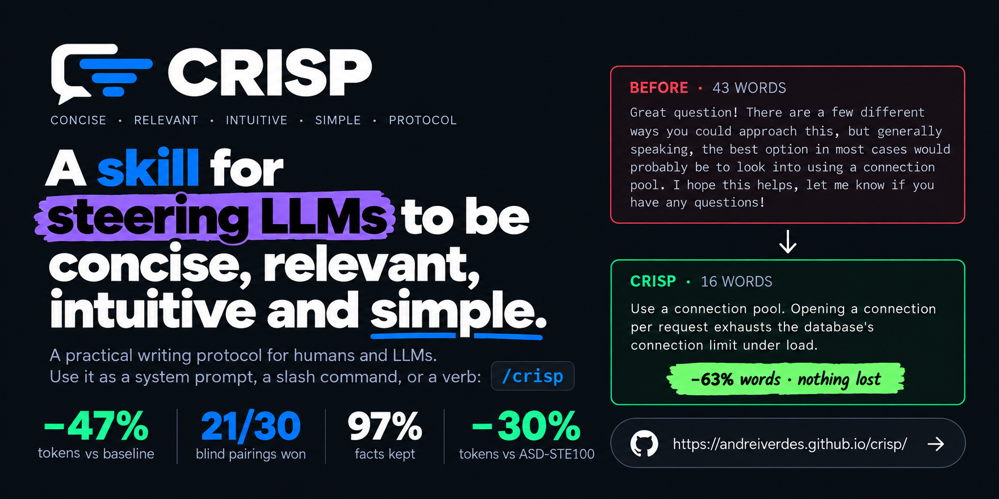

# CRISP

**Concise · Relevant · Intuitive · Simple · Protocol.** A writing protocol for humans and LLMs: say the useful thing once, as clearly as possible, then stop.

| Want to… | Open |
|---|---|
| Install as a Claude Code skill | `claude plugins marketplace add andreiverdes/awesome-claude` then `claude plugins install awesome-claude@awesome-claude`; `/crisp` is then available in every session |
| Use it in a project | `python3 skills/crisp/scripts/install.py --command` from the project root (adds a CRISP block to `AGENTS.md`/`CLAUDE.md` and a `/crisp` slash command) |
| Read the rules | `skills/crisp/SKILL.md` (one page) or `CRISP.md` section 7 and 22 |
| Paste a prompt | `skills/crisp/prompts/crisp.md` (80 words), `crisp-minimal.md` (200), `crisp-full.md` (590) |
| See the evidence | `CRISP.md` sections 1-3 (synthesis), `research/lanes/` (five source lanes with URLs) |
| See the benchmark | [andreiverdes.github.io/crisp/benchmark](https://andreiverdes.github.io/crisp/benchmark/) (3-tab dashboard); `CRISP.md` section 21; `bench/README.md` to rerun |

## Docs

### Install as a Claude Code skill

```
claude plugins marketplace add andreiverdes/awesome-claude
claude plugins install awesome-claude@awesome-claude
```

`/crisp` is then available in every Claude Code session. `/crisp` applies CRISP to everything that follows; `crispify this`, `make this crispier`, and `run a CRISP pass` rewrite the text you give. `/crisp 1`, `/crisp 2`, `/crisp 3` set depth (see Levels).

### Install into a project: `install.py`

Puts a CRISP block into the project's `AGENTS.md` and `CLAUDE.md` so every agent working in that repo replies in CRISP, whether or not the skill is installed. Run it from the project root:

```
python3 skills/crisp/scripts/install.py            # from this repo
python3 ~/.claude/plugins/marketplaces/awesome-claude/skills/crisp/scripts/install.py   # from the plugin
```

| Flag | What it does | Default |
|---|---|---|
| `--level crisp\|minimal\|full` | Which prompt to embed. `crisp`: 80 words, the benchmarked one. `minimal`: 200 words, adds the preamble ban-list, vague-word replacements, and formatting rules. `full`: 590 words, adds the priority order, the full ambiguity rules, the length table, and the CRISP pass. | `crisp` |
| `--file PATH` | Write to one file instead of auto-detecting. | `AGENTS.md` and `CLAUDE.md` if they exist; creates `AGENTS.md` if neither does |
| `--command` | Also write `.claude/commands/crisp.md`, so `/crisp` (with an optional level or text argument) works as a project slash command without the plugin. | off |
| `--print` | Print the block to stdout and change nothing. Use it to paste the block somewhere else. | |
| `--check` | Exit 0 if the block is present and matches the current prompt text, 1 if missing or stale. For CI or a pre-commit hook. | |
| `--remove` | Remove the block (and the command file when combined with `--command`). | |

The block is fenced by `<!-- crisp:start -->` / `<!-- crisp:end -->` and replaced in place on every run, so re-running after a prompt update or switching `--level` is safe; everything outside the fence is untouched. The prompt text is read from `skills/crisp/prompts/` at run time, so the script never drifts from the skill.

Which level: `crisp` for most projects. `minimal` when the model keeps slipping on a specific habit the short prompt doesn't name (preambles, vague words, over-formatting). `full` when compliance matters more than the ~600 tokens it costs on every turn, e.g. a repo whose agents write specs and status updates for humans.

### Levels

Same rules, different depth. `/crisp 1`: the answer and what's essential to act. `/crisp 2` (default): plus important details and one line that prevents a likely mistake. `/crisp 3`: plus rationale, alternatives, edge cases, risks. Levels never change writing quality, only how much is included.

### Prompts

Drop-in system prompts in `skills/crisp/prompts/`: `crisp.md` (80 words, inject into a live conversation), `crisp-minimal.md` (200), `crisp-full.md` (590), `crispify.md` (the rewrite variant). All four carry the same core behaviour; the longer ones spell out more of it.

### Reference

- `skills/crisp/SKILL.md`: one-page rules, levels, the CRISP pass, the 14-question checklist.
- `skills/crisp/reference/anti-patterns.md`: 48 AI-writing habits grouped in six families, each with its fix.
- `skills/crisp/reference/examples.md`: 12 before/after pairs across domains (debugging, specs, status updates, agent messages, research answers).
- `CRISP.md`: the full protocol. Sections 1–3 are the research synthesis, 7 the ten rules, 21 the benchmark, 22 the quick reference, 23 the prompts, 24 the checklist.
- `research/lanes/`: the five source lanes (controlled language, plain language, LLM prompting, agent context engineering, AI-writing anti-patterns) with fetched URLs.

### Benchmark

[andreiverdes.github.io/crisp/benchmark](https://andreiverdes.github.io/crisp/benchmark/): three tabs (CRISP vs baseline, CRISP vs ASD-STE100, Anthropic vs OpenAI builds) with every answer and judge note underneath. `bench/README.md` has the five commands to rerun it; `shared/` holds the fixtures, rubric, and both teams' results.

### Maintaining

`design/KERNEL.md` is the rule source of truth; `design/parts/*.md` are the sections; `python3 design/assemble.py` rebuilds `CRISP.md` and the skill's reference files. `site/hero.py` regenerates the README and SKILL.md banners; `site/build_data.py` then `site/build.py` rebuild the dashboard.

## Third-party and provenance

HorizonUI (Apache-2.0, HorizonLoop SRL) is vendored for the website; its NOTICE, licence, and font licences are in `third_party/`. `shared/` holds the benchmark fixtures, rubric, raw request logs, and both teams' results, including the second team's prompts and harness; provenance in `third_party/README.md`.
